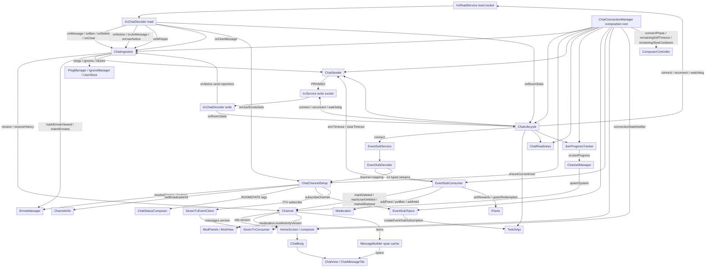
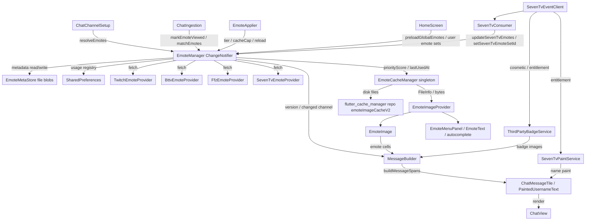
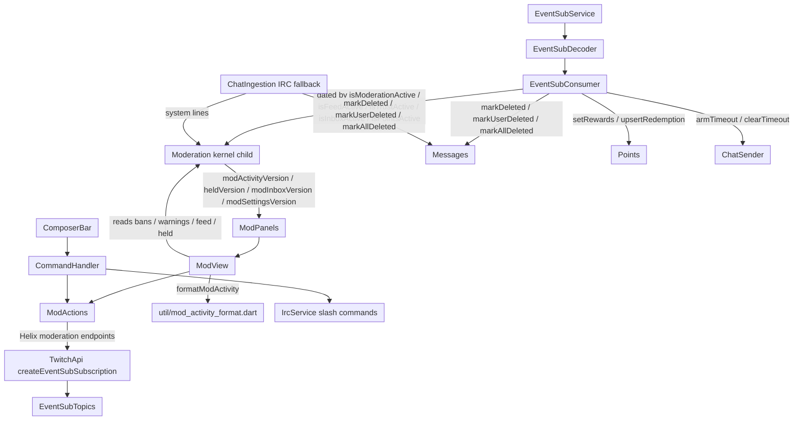
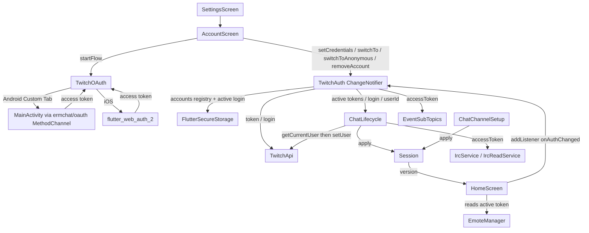
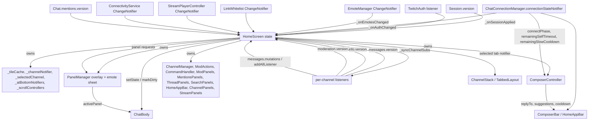
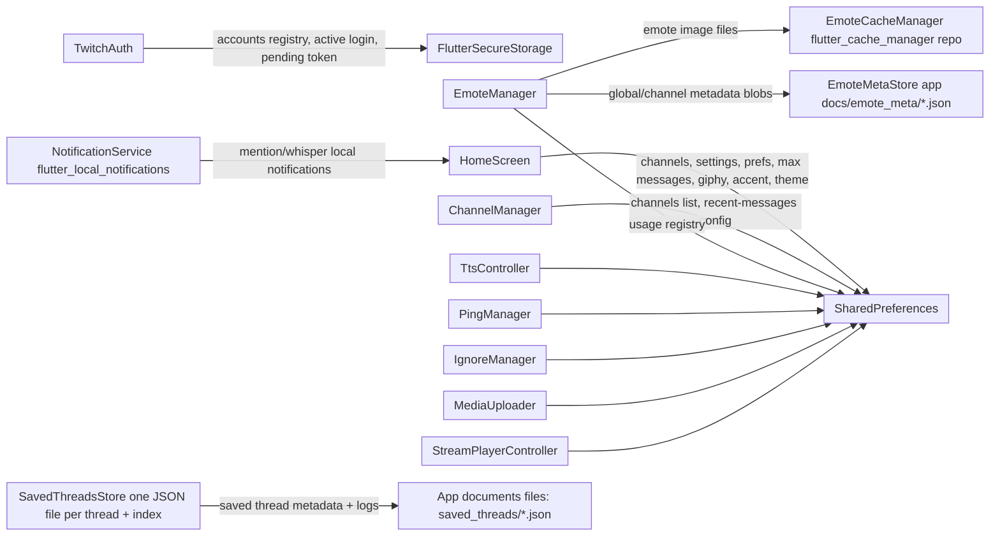

# ermchat architecture

ermchat is a single-package Flutter Twitch chat viewer. `HomeScreen` is the composition root: it constructs the chat kernel, the pipeline services, the transports, and every presentation panel, then wires them through constructor parameters and typed notifiers. Dependencies point inward and downward: raw transports feed decoders, decoders feed pipeline consumers, consumers mutate the `lib/chat/` kernel, and the UI reads kernel state and subscribes to the owner that emits changes. There is no global event bus; each owner exposes a typed `ValueNotifier` or `ChangeNotifier`.

Everything below is based on imports, constructor wiring in `main.dart`/`home_screen.dart`, and `attach()`/`addListener` registrations in the source. Arrows mean "depends on / feeds".

## Top-level overview

```mermaid
%%{init: {"flowchart": {"useMaxWidth": true, "nodeSpacing": 20, "rankSpacing": 30, "padding": 6}, "themeVariables": {"fontSize": "14px"}}}%%
flowchart TD
  subgraph entry["Entry and app shell"]
    main["main.dart"]
    app["TwitchChatApp"]
    home["HomeScreen"]
  end

  subgraph screens["Settings screens"]
    settings["SettingsScreen"]
    account["AccountScreen"]
  end

  subgraph present["Presentation"]
    chrome["chrome/ HomeAppBar, ChannelStack, StreamLayout"]
    panels["panels/ Mentions, Threads, Mod, Search"]
    composer["composer/ ComposerBar, ComposerController"]
    sheets["sheets/ MessageMenu, UserSheet"]
    widgets["widgets/ ChatBody, ChatView, MessageBuilder, ModView, tiles"]
  end

  subgraph kernel["Chat kernel"]
    chat["Chat"]
    channel["Channel"]
    children["Messages / Threads / Unread / Moderation / Points / ChannelInfo"]
    mentions["Mentions"]
  end

  subgraph pipeline["Chat pipeline"]
    ccm["ChatConnectionManager"]
    lifecycle["ChatLifecycle"]
    ingestion["ChatIngestion"]
    setup["ChatChannelSetup"]
    sender["ChatSender"]
    readiness["ChatReadiness"]
    joinprog["JoinProgressTracker"]
    statuscomp["ChatStatusComposer"]
    topics["EventSubTopics"]
    esconsumer["EventSubConsumer"]
    tvconsumer["SevenTvConsumer"]
    channelmgr["ChannelManager"]
  end

  subgraph transport["Transports and decoders"]
    irc["IrcService + IrcReadService"]
    ircdec["IrcChatDecoder"]
    eventsub["EventSubService"]
    esdec["EventSubDecoder"]
    tvclient["SevenTvEventClient"]
  end

  subgraph emotes["Emotes"]
    emoteman["EmoteManager"]
    emoteapplier["EmoteApplier"]
    cache["EmoteCacheManager"]
    providers["Twitch / BTTV / FFZ / 7TV providers"]
    paint["SevenTvPaintService"]
  end

  subgraph mod["Moderation"]
    modactions["ModActions"]
    cmdhandler["CommandHandler"]
    modview["ModView"]
  end

  subgraph auth["Auth and identity"]
    twitchauth["TwitchAuth"]
    session["Session"]
    oauth["TwitchOAuth"]
  end

  subgraph platform["Platform and persistence"]
    prefs["SharedPreferences"]
    secure["FlutterSecureStorage"]
    metastore["EmoteMetaStore"]
    savedthreads["SavedThreadsStore"]
    appfiles["App documents files"]
    notif["NotificationService"]
    foreground["foreground_task"]
    connectivity["ConnectivityService"]
    api["TwitchApi"]
  end

  main --> app
  app --> home
  app --> twitchauth
  home --> ccm
  home --> channelmgr
  home --> chat
  home --> session
  home --> emoteman
  home --> chrome
  home --> panels
  home --> composer
  home --> sheets
  home --> widgets
  home --> settings
  home --> notif
  home --> foreground
  home --> prefs
  settings --> account
  account --> oauth
  account --> twitchauth
  oauth -->|token| twitchauth

  ccm --> lifecycle
  ccm --> ingestion
  ccm --> setup
  ccm --> sender
  ccm --> readiness
  ccm --> joinprog
  ccm --> topics
  ccm --> esconsumer
  ccm --> tvconsumer

  lifecycle --> irc
  lifecycle --> eventsub
  lifecycle --> tvclient
  lifecycle --> readiness
  lifecycle --> joinprog
  lifecycle --> topics
  lifecycle --> sender
  irc --> ircdec
  eventsub --> esdec
  ircdec --> ingestion
  ircdec --> setup
  ircdec --> lifecycle
  esdec --> esconsumer
  esdec --> topics
  tvclient --> tvconsumer

  ingestion --> channel
  ingestion --> chat
  ingestion --> sender
  setup --> channel
  setup --> statuscomp
  setup --> emoteman
  setup --> topics
  esconsumer --> channel
  esconsumer --> sender
  tvconsumer --> emoteman
  channelmgr --> chat
  channelmgr --> ccm
  channelmgr -->|host.markDirty| home

  chat --> channel
  channel --> children
  chat --> mentions
  channelmgr --> channel
  widgets --> channel
  widgets --> emoteman
  composer --> ccm
  composer --> emoteman
  panels --> channel
  panels --> ccm
  chrome --> channel
  chrome --> ccm
  modview --> channel
  modview --> modactions

  emoteman --> cache
  emoteman --> providers
  emoteman --> metastore
  metastore --> appfiles
  savedthreads --> appfiles
  emoteman --> prefs
  emoteapplier --> emoteman
  tvclient --> paint
  paint --> widgets
  cache --> widgets
  modactions --> api
  cmdhandler --> modactions
  cmdhandler --> irc
  esconsumer --> children
  topics --> api
  api --> twitchauth
  twitchauth --> secure
  lifecycle --> session
  session --> home
  lifecycle --> api
  irc --> connectivity
  eventsub --> connectivity
  tvclient --> connectivity
  emoteman --> connectivity
  panels --> savedthreads
```



## Chat data pipeline



`ChatReadiness` is a pure state holder answering `pipeUp`, `isChannelReady`, and join-failure queries from injected connection predicates. `ChatSender` owns macros, slash dispatch, the duplicate-text bypass, and the self-timeout/slow-mode gates. `JoinProgressTracker` reads the shared `JoinRateLimiter` and emits `JoinProgress` once per second. `ChatStatusComposer` merges ROOMSTATE tags with periodic Helix stream info into `ChannelInfo.status`.

## Emotes



`EmoteManager` owns global, per-channel, and personal 7TV caches, the provider merge order (7TV > BTTV > FFZ > Twitch), the account-scoped unlock and personal-set state, and a rolling usage score that feeds `EmoteCacheManager` eviction priority. Live 7TV deltas update the manager without bumping its `version`, so already-rendered spans are not retroactively recomputed; full refetches bump it and `MessageBuilder` recomputes spans lazily.

## Moderation



`EventSubTopics` owns the seven topic families (`channel.moderate`, AutoMod, feed, inbox, trust, points, widgets), the per-family active/skip sets, and the account-scoped 403 skip sets. `EventSubConsumer` applies the decoded events; while `channel.moderate` v2 is active it suppresses the duplicate IRC moderation echoes in `ChatIngestion`.

## Auth and accounts



`TwitchAuth` is the only owner of credentials (secure-storage registry plus the active account). `Session` is identity only (login/userId plus `version`); it lives outside the kernel, and the pipeline (`ChatLifecycle` and `ChatChannelSetup`) is the only production path that calls `Session.apply`. Anonymous mode clears the active credentials but keeps the saved registry.

## UI and state flow



Key typed notifiers: `Session.version`, `ChatConnectionManager.connectionStateNotifier`, `Chat.mentionsBump` / `unreadVersion` / `loadFailedChannels`, `Channel.messages.version`, `Channel.messages.mutations` (a synchronous listener set, not a `ValueNotifier`), `Channel.info.version`, `Channel.moderation.version` / `heldVersion` / `modActivityVersion` / `modFeedVersion` / `modInboxVersion` / `modSettingsVersion`, `Channel.points.version`, `EmoteManager.version`, `TwitchBadgeService.version`, `ThirdPartyBadgeService.version`, `LinkWhitelist`, `StreamPlayerController`, `ConnectivityService`, `PanelManager`. View-only caches (tile cache, panel data) stay in `HomeScreen` and are driven by these notifiers.

## Persistence



## Layer and dependency direction

Intended direction (from AGENTS.md, verified in code):

```
transport (IRC / EventSub / 7TV websocket)
  -> decode (IrcChatDecoder / EventSubDecoder)
  -> domain + kernel (Chat / Channel / children, Session)
  -> pipeline (ChatConnectionManager + ChatIngestion / ChatChannelSetup /
     EventSubConsumer / SevenTvConsumer / ChatLifecycle / ChatSender / readiness)
  -> presentation (HomeScreen / panels / chrome / composer / widgets)
```

Observed departures from the stated "only `Channel` verbs mutate children" and "pipeline must not re-implement state rules" conventions:

- `ChatChannelSetup` calls `chat.channelFor(channel).info.setBroadcasterId(...)` directly, and `ChatStatusComposer` calls `ChannelInfo.setStatus(...)` directly. `ChannelInfo` is a kernel child and has no `Channel` verb wrapper.
- `EventSubConsumer` mutates `Moderation` (`addFeed`, `putBan`, `removeBan`, `addWarning`, `addHeld`, `noteSuspicious`, `touchInbox`, `touchSettings`), `Messages` (`markDeleted`, `markUserDeleted`, `markAllDeleted`), and `Points` (`setRewards`, `upsertRedemption`, `resolveRedemption`) directly from the pipeline.
- `HomeScreen._addSystemMessage` calls `Messages.addSystem` directly, and `_onEmotesChanged` / settings setters call `ChannelInfo.touch()` directly.
- `ChannelManager` calls `Messages.addSystem` / `removeSystem` / `upsertSystem` / `removeLoadingHistory` and `ChannelInfo.touch` directly.
- `ChatIngestion` calls `Messages.markDeleted` / `markUserDeleted` / `markAllDeleted` and `Messages.updateText`; the row-scoped moderation edits are the documented exception, but `updateText` and the `ChannelInfo` writes are not wrapped in a `Channel` verb.

These are all reads-and-writes against kernel children that are globally readable, so they do not violate the data-flow direction, but they do bypass the "verbs only" mutation boundary. A stale comment in `chat_sender.dart` says "the write socket also JOINs its channels": `IrcReadService` is documented as the sole JOINer, `IrcService` is join-free, and `ChatReadiness` notes the write JOIN set stays empty in production.

The AGENTS.md phrase "EventSub is moderation-only" is a simplification: the code also subscribes to broadcaster-only channel points (`channel.channel_points_custom_reward*`), unban-request inbox, AutoMod terms/settings, feed (shield/shoutout/warning), and suspicious-user trust events, plus the broadcaster widgets.

## Who writes what (mutation map)

Most arrows in the diagrams are reads or constructor injection, which do not make change hard. What makes change hard is shared mutable state with several writers. Outside `lib/chat` the entire write surface is 33 call sites; after removing notify-only bumps (`ChannelInfo.touch()` is `version.value++`, `info.dart:54`) and the documented row-delete exception, about 19 real writes remain, all through public child methods.

| Kernel state | Writer API | Outside-kernel writers |
|---|---|---|
| `ChannelInfo` | `setBroadcasterId` | `ChatChannelSetup` (`chat_channel_setup.dart:188`), `EmoteApplier` (`emote_applier.dart:213`) |
| `ChannelInfo` | `setStatus` | `ChatStatusComposer` (`chat_status_composer.dart:154`) |
| `ChannelInfo` | `Channel.setHistoryLoaded` (verb) | `ChannelManager` x4 (`channel_manager.dart:157,169,335,348`) |
| `ChannelInfo` | `touch()` (notify only) | `HomeScreen` x13, `ChannelManager` x1 |
| `Messages` | `markDeleted` / `markUserDeleted` / `markAllDeleted` | `ChatIngestion` x3, `EventSubConsumer` x2 (documented exception) |
| `Messages` | `addSystem` / `removeLoadingHistory` | `ChannelManager` (`channel_manager.dart:329,297`) |
| `Moderation` | `Channel.clearHeldModeration` (verb) | `ChannelManager` (`:377`), `ChatLifecycle` (`:512,594`) |
| `Moderation` | `removeBan` | `EventSubConsumer` (`:205`), `ModView` (`mod_view.dart:1041`) |
| `Moderation` | `touchInbox` | `EventSubConsumer` x2 (`:452,486`) |
| `Moderation` | `resolveHeld` | `EventSubConsumer` (`:607`) |

Every entry calls a public method on the child; none reaches into private state. `ChannelInfo.setHistoryLoaded` and `Moderation.clearHeld` now funnel through the `Channel` verbs above, so each has a single writer path. The remaining coordination gap is the loading-history row (`Messages.addSystem` / `removeLoadingHistory` from `ChannelManager`), which a stable-id system line would close; the current fold renders several connection lines, so that change is deferred.

## Services table

| Component | File | Responsibility |
|---|---|---|
| `ChatConnectionManager` | `lib/services/chat_connection_manager.dart` | Composition root for the chat pipeline; builds and disposes every pipeline owner and exposes phase/readiness/send/gating queries. |
| `ChatLifecycle` | `lib/services/chat_lifecycle.dart` | Connect orchestration, socket status listeners, watchdog, reconnect, token-expiry handling, identity resolution. |
| `ChatIngestion` | `lib/services/chat_ingestion.dart` | Translates IRC PRIVMSG/CLEARMSG/CLEARCHAT/NOTICE/USERNOTICE/own-echo into kernel mutations and feature-sink calls. |
| `ChatChannelSetup` | `lib/services/chat_channel_setup.dart` | Joins, Helix user-id lookup, badge/emote resolution, 7TV subscriptions, and chat-status composition. |
| `ChatSender` | `lib/services/chat_sender.dart` | Outbound send path: macros, slash dispatch, duplicate-text bypass, self-timeout and slow-mode gates. |
| `ChatReadiness` | `lib/services/chat_readiness.dart` | Join-confirmation and read-socket-health state behind readiness queries. |
| `ChatStatusComposer` | `lib/services/chat_status_composer.dart` | Merges ROOMSTATE mode tags and periodic Helix stream info into `ChannelInfo.status`. |
| `JoinProgressTracker` | `lib/services/join_progress_tracker.dart` | Emits per-channel JOIN-queue position/ETA from the shared `JoinRateLimiter`. |
| `JoinRateLimiter` | `lib/services/join_rate_limiter.dart` | Token bucket pacing the combined JOIN rate of both IRC sockets. |
| `EventSubTopics` | `lib/eventsub/topics.dart` | Owns EventSub topic families, active/skip sets, and Helix subscription creation. |
| `EventSubConsumer` | `lib/services/eventsub_consumer.dart` | Applies typed EventSub events to `Moderation`, `Messages`, `Points`, and system lines. |
| `SevenTvConsumer` | `lib/services/seven_tv_consumer.dart` | Applies 7TV socket emote-set/user events to `EmoteManager`. |
| `SevenTvEventClient` | `lib/services/seven_tv_event_client.dart` | 7TV Event API websocket: emote-set, user, cosmetic, entitlement, and personal-set streams. |
| `SevenTvPaintService` | `lib/services/seven_tv_paint_service.dart` | Parses and caches 7TV name paints for username rendering. |
| `EmoteManager` | `lib/services/emote_manager.dart` | Emote daemon: provider merge, global/channel/personal caches, metadata TTL, usage registry, span-cache version. |
| `EmoteCacheManager` | `lib/services/emote_cache_manager.dart` | Disk cap, priority eviction, overflow temp-file serving for emote images. |
| `EmoteMetaStore` | `lib/services/emote_meta_store.dart` | File-backed persistence for MB-scale emote metadata blobs. |
| `EmoteApplier` | `lib/emotes/emote_applier.dart` | Applies tier/cache/auto-mode settings, reload, and account-scoped emote refresh. |
| `TwitchApi` | `lib/services/twitch_api.dart` | Helix REST client: users, streams, badges, moderation, EventSub subscription creation, points. |
| `TwitchAuth` | `lib/services/twitch_auth.dart` | Multi-account registry in secure storage plus the active account credentials. |
| `TwitchOAuth` | `lib/services/twitch_oauth.dart` | OAuth flow (Android MainActivity Custom Tab, iOS `flutter_web_auth_2`), scopes, state validation. |
| `Session` | `lib/client/session.dart` | Active identity (login/userId) with a `version` notifier; identity only, no chat state. |
| `ModActions` | `lib/services/mod_actions.dart` | Helix moderation verbs: ban/timeout, delete, warn, shield, shoutout, terms, points rewards. |
| `CommandHandler` | `lib/services/command_handler.dart` | Slash-command routing to `ModActions`, Helix, and the IRC write socket. |
| `ChannelManager` | `lib/channels/channel_manager.dart` | Channel membership, join/leave, history backfill, selection commit, join-progress system lines. |
| `RecentMessagesService` | `lib/services/recent_messages.dart` | Fetches robotty/zneix recent-message history with provider failover. |
| `SavedThreadsStore` | `lib/services/saved_threads_store.dart` | File-backed saved-thread metadata and full per-thread message logs. |
| `PingManager` | `lib/services/ping_manager.dart` | Highlight/mention rules, own-message participation, display-name tracking. |
| `IgnoreManager` | `lib/services/ignore_manager.dart` | Ignored users and keyword block/rewrite rules applied before pings. |
| `LinkWhitelist` | `lib/services/link_whitelist.dart` | Domain/TLD allow list gating link previews and click handling. |
| `TtsController` | `lib/services/tts_controller.dart` | Reads chat messages aloud with queue/format/user-ignore settings. |
| `MediaUploader` | `lib/services/media_uploader.dart` | Uploads pasted/selected media to configured hosts and records recent uploads. |
| `NotificationService` | `lib/services/notification_service.dart` | Local notifications for mention push and whisper alerts. |
| `TwitchBadgeService` | `lib/services/twitch_badge_service.dart` | Global/channel Twitch badge sets, avatars, and broadcaster-id to login mapping. |
| `ThirdPartyBadgeService` | `lib/services/third_party_badge_service.dart` | FFZ/BTTV/7TV badge lookup bound to the 7TV socket. |
| `AnalyticsService` | `lib/services/analytics_service.dart` | Per-channel message and moderation counters with emote usage lookup. |
| `StreamPlayerController` | `lib/services/stream_player_controller.dart` | Stream layout/player state and preferences. |
| `PipService` | `lib/services/pip_service.dart` | Picture-in-picture lifecycle callbacks. |
| `ConnectivityService` | `lib/services/connectivity_service.dart` | Connectivity/wifi-vs-mobile state consumed by transports and emote TTL logic. |
| `MessageBuilder` | `lib/widgets/message_builder.dart` | Builds and caches message spans, keyed on emote/badge/link versions. |
