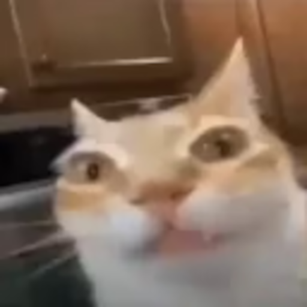
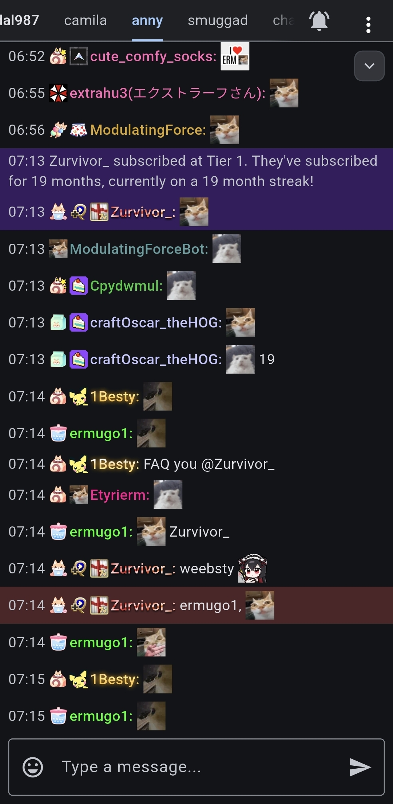
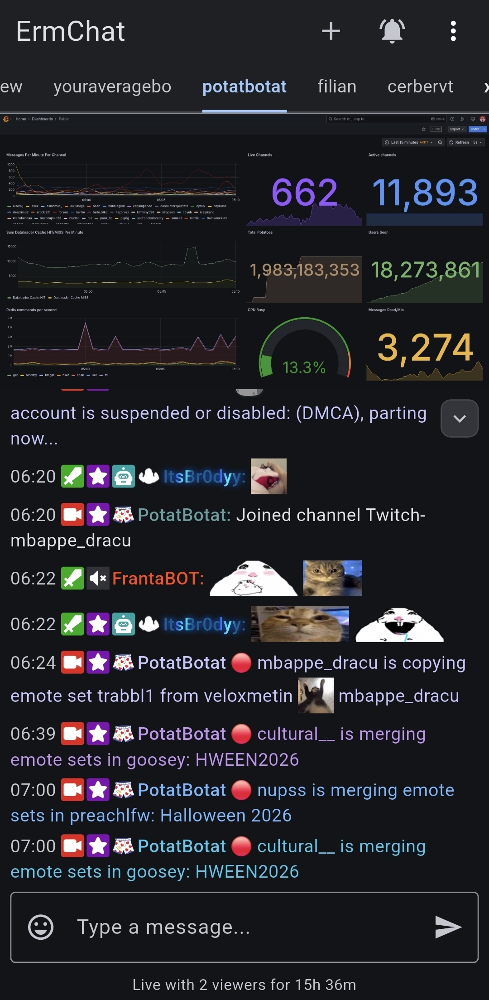
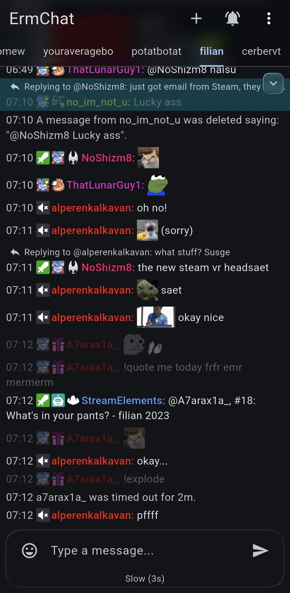
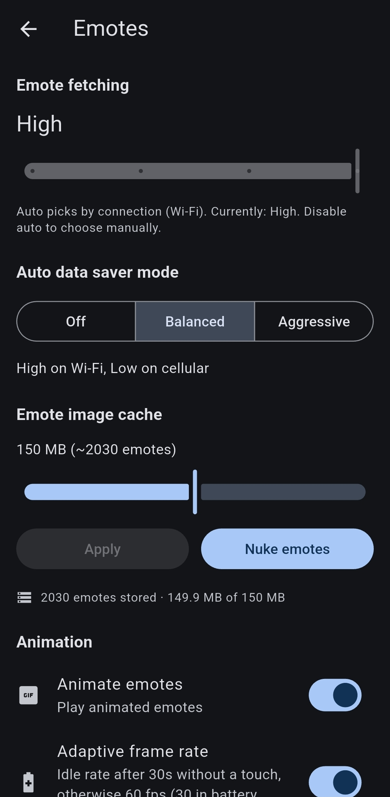

  

<h1 align="center">ErmChat</h1>

  A Twitch chat app for Android and iOS.

  
  
  
  
  
  

  
  <!-- Add appstore badge when listed (AppStore nobletrash38) -->

  
  
  
  

## Features

**Emote cache:** Novel cache system, so you don't need to re-download emotes every single time you restart the app.

**Data saver:** With the new emote cache, going on an excursion no longer makes a massive dent in your data. Customizable of course.

**Threads:** Can be saved, and persist for as long as the latest message exists. Revisit old threads whenever you want.

**Split links:** Chatters split links to get past filters. ErmChat joins them for you to save a bit of hassle.

**7TV integration:** 7tv name paints are supported, along with personal emotes, and emotes are updated live.

**Media embeds:** You can show images from some popular CDNs inline without having to leave the app.

**GIFs:** Official twitch GIFs are supported (view-only).

**Compact layout:** For small screens: collapse padding and headers to squeeze a bit more real estate for chat.

**Mod view:** AutoMod queue, unban requests, blocked terms, warnings, suspicious users and a mod activity feed. Broadcasters also get Channel Points redemptions, polls, predictions, raids and markers.

**Chat analytics:** Per channel msgs/min, chatter list, top chatters, most used emotes/words, bans, timeouts.

**Liquid glass:** (opt-in, experimental, it's quite heavy so beware).

**Performance:** A lot of work has gone into optimizing for battery life and fps. However, this is a heavy app, so there are lots of settings to disable or reduce the amount of battery-heavy work.

**Accessibility:** TTS, line highlighting, font size, emote freeze. I'll get to translations soon, and maybe a reduced motion mode.

<b>Everything else</b>

- Emotes from Twitch, BTTV, FFZ and 7TV, third-party badges
- Multiple channels in swipeable tabs, multiple accounts
- Mentions and whispers panel, user cards with a list of messages from that user
- Slash commands with autocomplete, and your own command macros
- Highlights and pings (customizable)
- Shared chat with spotlight feature (see own chat better, customizable in settings)
- Stream player with picture-in-picture
- Image uploads with EXIF stripping
- Chat history on join, slow mode / timeout countdown, live channel status
- Backgrounding and mention notifications (Android only, iOS coming soon)
- Themes, true black, accent colors, timestamp formats
- Lots of customizability in settings

## Install

**Android:** get it on [Google Play](https://play.google.com/store/apps/details?id=io.github.bananguh.ErmChat), or download the universal APK from [Releases](https://github.com/banan-guh/ErmChat/releases/latest). Pending F-Droid.

**iOS:** join the beta on [TestFlight](https://testflight.apple.com/join/NUUDJ5qY). You need TestFlight (obviously). An App Store release is planned.

No account needed to read chat anonymously, but signing in is recommended for the full feature set.

## Privacy

ErmChat communicates directly with Twitch servers, and uses (anonymous) emote providers / recent-messages for chat history. Media uploader is third-party. Details: [privacy policy](https://banan-guh.github.io/ErmChat/).

## Feedback

Any feedback, no matter what, is VERY much appreciated. You have multiple ways to give it:

- Create an issue on GitHub (here), bugreport or feature request
- Create an issue on [Discord](https://discord.gg/asWuEHW359), or even just send something in general
- Come to my twitch channel (not live, only chat) at #ermugo2 and tell me directly - join the channel in ermchat!
- Send an email to kuhwalri.contact@gmail.com

An in-app bug reporter is on the way, but it's not finished yet.

## Credits

Inspired by NobleTrash, [DankChat](https://github.com/flxrs/DankChat) and [Chatsen](https://github.com/chatsen/chatsen). @stewlyblume is the cat.

## License

[MIT](LICENSE). Some logic (and the UI style) is derived from DankChat. See [THIRD_PARTY_LICENSES](THIRD_PARTY_LICENSES).
